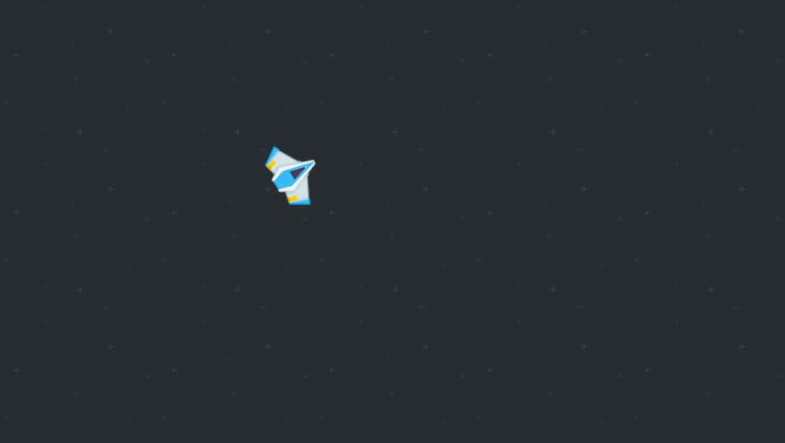
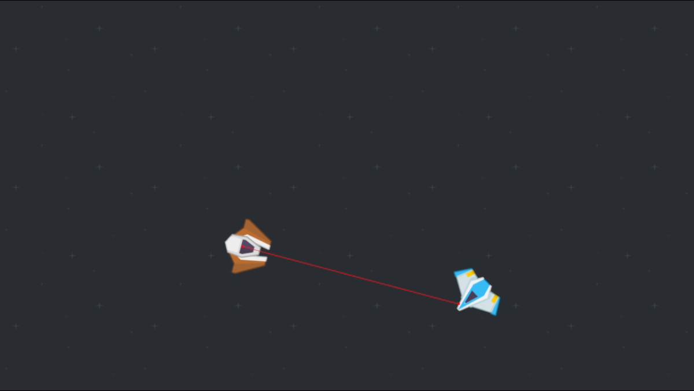
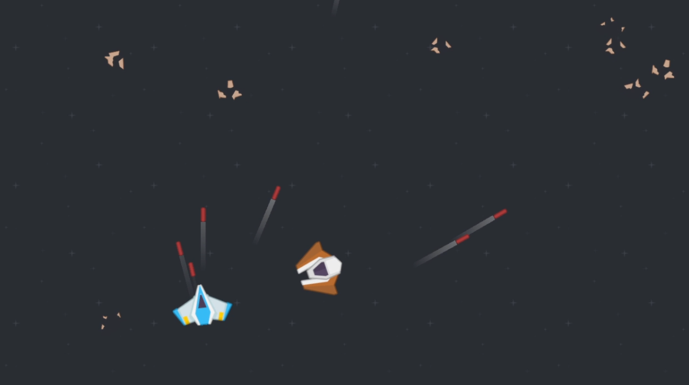

# Godot Space Game

### Description:

This is my first time creating a game without the explicit guidance of a course.

While there aren't any major specifics to the game yet, my first goal is to just build a simple top-down arcade shooter set in space.

## Credits:

### Sprites, SFX, PNGs:

- Space Shooter (Redux, plus fonts and sounds) by Kenney
  on [Kenney.nl](https://www.kenney.nl).
- Space Shooter Extension by Kenney on [Kenney.nl](https://www.kenney.nl).
- Sci-fi Audio by Kenney on [Kenney.nl](https://www.kenney.nl)

## Progress:

### Player movement:

Player slides across screen with limited friction. Wanted to strike a balance between being harder to control but fun to slide around.

### Enemy Tracking:

Enemies can now track the player, and follow them around map.

### Projectiles + Ship Debris

Simple Projectiles now can be fired from the player and ship debris will form when (currently only enemy) ships lose a quarter of health.

Debris will have to be dodged as the player can collide with them and it will slow them down.
